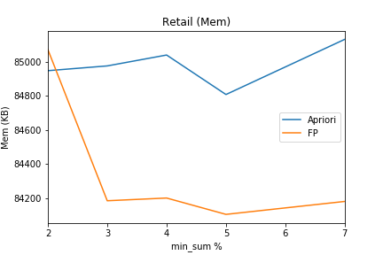

### Data Mining Lab 1
#### Abdullah al Thaki
#### Roll: 12

### Introduction
Apriori and FP growth are two popular basic mining algorithm which extract frequent itemsets. Here we have two compared these two algorithm on several real life datasets. The datasets are of different types, statistics are given for corresponding datasets.

We know that apriori takes longer time compared to fp-growth. Apriori scans dataset as it is processing for new lenght. But fp-growth only scans datasets two times. Apriori has greater memory consumptions because it makes many candidates especially in 1 and 2 itemsets generations. This is not the case for fp-growth as it processes in tree.

| Dataset | Size (MB) | #Trans | #Items | Max TL | Avg TL | Avg TL/#Items (X100)| Type |
|---|---|---|---|---|---|---|---|
| chess.dat | 0.33 | 3196 | 75 | 37 | 37.00 | 49.33 | Dense |
| kosarak.dat | 30.55 | 990002 | 41270 | 2498 | 8.10 | 0.02 | Large |
| mushroom.dat | 0.54 | 8124 | 119 | 23 | 23.00 | 19.33 | Dense |
| pumsb.dat | 15.92 | 49046 | 2113 | 74 | 74.00 | 3.50 | Sparse |
| pumsb_star.dat | 10.77 | 49046 | 2088 | 63 | 50.48 | 2.42 | Sparse |
| retail.dat | 3.97 | 88162 | 16470 | 76 | 10.31 | 0.06 | Sparse |

### Execution Time

#### Finding
 We can see that there is a generalisation that apriori takes longer times compared to fp-growth. But shorter times required as minimum support theshold increases.

### Memory Consumption

#### Finding
Like in previous section, we can see that there is a generalisation that apriori takes longer times compared to fp-growth. But shorter times required as minimum support theshold increases. Most of the times fp-growth's memory consumption is constant.